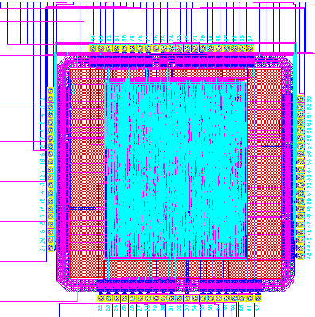

# Core-VLSI

Author: Andrew Vuong, Farhan Narsullah, Gang Liu

A 16-bit Core implemented in Verilog and built in VLSI using Synopsis and Cadence. Includes a custom cell library for all of the cells used within the core.

VerilogFiles - Contains all of the verilog files used to create the core and its uses.
Cells - Cell library containing all of the cells used to generate the core
topVerilog - Cell library containing assembled core and its pieces.

The core is designed to communicate with a DAC and output audio depending on the button pressed by checking EPROM.

